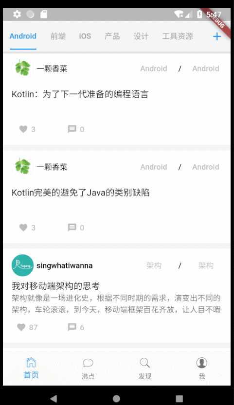

# 用flutter山寨一下掘金

## 写在前面
最近开始学习flutter，自觉内容比较多，得多练练才能熟悉，于是乎就开始山寨掘金。话不多说，上图：
## 阅读重点
此项目并不是完全仿掘金，只是通过掘金的ui和接口来熟悉flutter，所以功能不全，之后再慢慢实现和优化吧。
## 最后叨叨
小前端一枚，不会iOS和Android开发，总觉得webapp的表现不尽如人意，因此感觉学习flutter很有必要啊。写的过程中遇到很多问题，花了不少时间，有的解决了，有的没解决，英文文档里很多组件没有例子，得自己试。本想着一边写，一边翻译一下文档，但写了一些组件后搁置了，内容太多。

